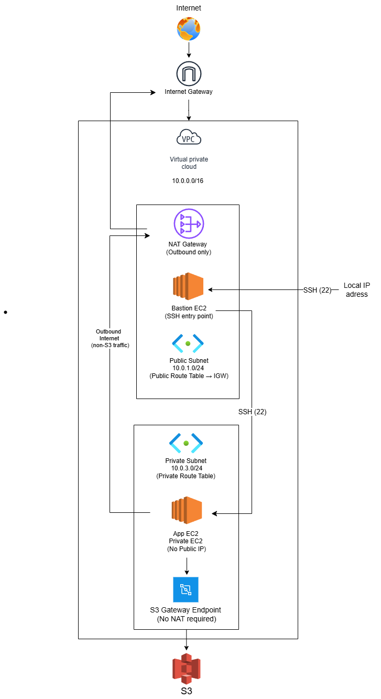

# ☁️ Week 12 — VPC & Networking: `vpc-infra-deployer`

> **Cloud Engineering Roadmap** · Week 12 of 24

A fully scripted AWS network infrastructure tool that builds a production-structured VPC from scratch — public and private subnets, internet gateway, NAT gateway, bastion host, private app server with Nginx, IAM role for S3 access, and a VPC Gateway Endpoint — all wired together via Bash and the AWS CLI, zero console clicking.

---

## 📋 Overview

In Week 11, EC2 instances lived in the default VPC — a shared, pre-configured network you don't control. This week I build **the network itself**.

`vpc-infra-deployer` automates the full lifecycle of a production-structured AWS network: VPC creation, subnet design, routing, NAT, secure bastion access, IAM-based S3 connectivity from a private subnet, and complete teardown in the correct dependency order. This is the same three-tier architecture pattern used in real production environments — public layer, private app layer, and secure data access — before any load balancer or database is added.

---

## 🏗️ Architecture



```
Internet
    ↓
Internet Gateway
    ↓
┌─────────────────────────────────────────┐
│           VPC  10.0.0.0/16              │
│                                         │
│  ┌──────────────────────────────────┐   │
│  │     Public Subnet 10.0.1.0/24    │   │
│  │   Bastion EC2 │ NAT Gateway      │   │
│  └──────────────────────────────────┘   │
│            ↓ (NAT outbound only)        │
│  ┌──────────────────────────────────┐   │
│  │    Private Subnet 10.0.3.0/24    │   │
│  │   App Server EC2 (Nginx)         │   │
│  │   IAM Role → S3 via VPC Endpoint │   │
│  └──────────────────────────────────┘   │
└─────────────────────────────────────────┘
```

**Traffic flows:**
- `Your machine → SSH → Bastion (public)` → SSH with agent forwarding → App Server (private)
- `App Server → NAT Gateway → IGW → Internet` (outbound only, no inbound)
- `App Server → S3 VPC Endpoint → S3` (stays within AWS backbone, no NAT cost)

---

## 📁 Project Structure

```
vpc-infra-deployer/
├── deploy.sh                   # Full infrastructure launcher — VPC to EC2, 4 idempotent phases
├── teardown.sh                 # Destroys all resources in correct dependency order
├── userdata.sh                 # EC2 boot script — installs Nginx, tests IAM role at boot
├── config.env                  # Environment config (not committed)
├── iam/
│   └── ec2-trust-policy.json   # IAM trust policy allowing EC2 to assume the role
├── diagrams/
│   └── architecture.png        # VPC architecture diagram
└── README.md
```

---

## ✨ Features

- 🏗️ **Full VPC from scratch** — CIDR design, public + private subnets, IGW, NAT Gateway, route tables, all scripted
- 🔄 **Idempotent 4-phase deploy** — each phase checks state before running; safe to re-run after partial failures
- 🏰 **Bastion host pattern** — SSH agent forwarding to reach private instances without copying keys
- 🔒 **Security Group referencing** — app server allows SSH from bastion's SG ID, not an IP
- 🎭 **IAM Role for EC2** — S3 access via instance profile, zero hardcoded credentials
- 🔌 **S3 VPC Gateway Endpoint** — S3 traffic stays within the AWS backbone, bypasses NAT
- ⚡ **Automated boot config** — Nginx installed and IAM role tested before you SSH in
- 🧹 **Dependency-aware teardown** — correct deletion order across VPC, NAT, IGW, IAM, subnets
- 📋 **Full state tracking** — `.deploy_state` tracks all resource IDs across all phases

---

## 🛠️ Skills Demonstrated

| Area | Details |
|------|---------|
| **VPC Design** | CIDR planning, public/private subnet architecture, multi-layer isolation |
| **Routing** | Route tables, IGW routes, NAT Gateway routes, VPC Gateway Endpoint routes |
| **NAT Gateway** | Creation, polling for availability, teardown sequencing |
| **Bastion Host** | SSH agent forwarding, SG-to-SG referencing, secure jump pattern |
| **IAM for EC2** | Role creation, instance profile, credential-free S3 access via IMDS |
| **VPC Endpoints** | S3 Gateway Endpoint, private route table integration |
| **Bash Scripting** | Idempotent phase architecture, state-gating, polling loops, re-entrant design |
| **AWS CLI** | Full VPC lifecycle, IAM management, multi-resource orchestration |
| **Security** | Least-privilege SG rules, private subnet isolation, no public IPs on app servers |

---

## ⚙️ Technical Highlights

### Idempotent 4-Phase Deployment
Each phase writes completion flags to `.deploy_state` and checks them before running. A crashed deploy can be resumed without re-creating already-provisioned resources:
```bash
if [ "${PART_B_DONE:-false}" = "true" ]; then
  echo "Security Groups & IAM already done"
else
  run_part_b
fi
```

### NAT Gateway Polling Loop
AWS has no built-in waiter for NAT Gateway — this polling loop fills the gap:
```bash
while true; do
    STATE=$(aws ec2 describe-nat-gateways \
      --nat-gateway-ids "$NAT_ID" \
      --query 'NatGateways[0].State' --output text)
    [ "$STATE" = "available" ] && break
    echo "NAT state: $STATE — waiting..."
    sleep 10
done
```

### Security Group Referencing
App server allows SSH from the bastion's Security Group ID — not an IP. Survives bastion IP changes:
```bash
aws ec2 authorize-security-group-ingress \
  --group-id "$APP_SERVER_SG_ID" \
  --protocol tcp --port 22 \
  --source-group "$BASTION_SG_ID"
```

### IAM Role — Zero Credentials on EC2
The app server never runs `aws configure`. Credentials come automatically from IMDS via the instance profile. Tested at boot:
```bash
aws s3 ls > /var/log/s3_test.txt 2>&1 || true
```

### S3 VPC Gateway Endpoint
S3 traffic from the private subnet stays entirely within the AWS backbone — no NAT Gateway cost, no public internet exposure:
```bash
aws ec2 create-vpc-endpoint \
  --vpc-id "$VPC_ID" \
  --service-name "com.amazonaws.$REGION.s3" \
  --route-table-ids "$PRIVATE_ROUTE_TABLE_ID" \
  --vpc-endpoint-type Gateway
```

### Correct Teardown Dependency Order
VPC resources have strict deletion dependencies. The teardown follows the correct sequence:
```
instances terminated → VPC endpoint deleted → NAT gateway deleted (polled)
→ Elastic IP released → Security Groups deleted → route tables disassociated + deleted
→ IGW detached + deleted → subnets deleted → VPC deleted → IAM cleaned up
```

---

## 🚀 Setup & Configuration

### Prerequisites
- AWS CLI v2 installed and configured (`aws configure`)
- An active AWS account with EC2 and IAM permissions
- Bash shell (Linux / macOS / WSL)
- An existing EC2 key pair (or let the script create one)

### 1. Clone the repo
```bash
git clone https://github.com/<your-username>/vpc-infra-deployer.git
cd vpc-infra-deployer
```

### 2. Create `config.env`
```bash
cp config.env.example config.env
```

Edit `config.env`:
```bash
REGION="eu-west-1"
VPC_CIDR="10.0.0.0/16"
PUBLIC_SUBNET_CIDR="10.0.1.0/24"
PRIVATE_SUBNET_CIDR="10.0.3.0/24"
AZ="eu-west-1a"
AMI_ID="ami-xxxxxxxxxxxxxxxxx"        # Ubuntu 22.04 LTS in your region
INSTANCE_TYPE="t2.micro"
KEY_NAME="week12-key"
BASTION_SG_NAME="week12-bastion-sg"
APP_SG_NAME="week12-app-sg"
IAM_ROLE_NAME="week12-ec2-s3-role"
IAM_PROFILE_NAME="week12-ec2-profile"
S3_BUCKET="your-existing-bucket-name"
PROJECT_TAG="cloudpath"
WEEK_TAG="12"
```

> Find the correct Ubuntu 22.04 AMI ID for your region at [Ubuntu EC2 AMI Finder](https://cloud-images.ubuntu.com/locator/ec2/)

### 3. Make scripts executable
```bash
chmod +x deploy.sh teardown.sh
```

---

## 📖 Usage

### Deploy everything
```bash
./deploy.sh
```

The script runs in 4 phases and prints progress at each step. On completion:
```
Bastion IP: 54.x.x.x
App private IP: 10.0.3.x
ssh-add week12-key.pem
ssh -A ubuntu@54.x.x.x
ssh ubuntu@10.0.3.x
```

### Verify the architecture

**1. SSH into bastion:**
```bash
ssh-add week12-key.pem
ssh -A ubuntu@<bastion-public-ip>
```

**2. From bastion — reach app server:**
```bash
ssh ubuntu@<app-server-private-ip>
```

**3. From app server — verify Nginx:**
```bash
curl localhost
# Returns your Week 12 HTML page
```

**4. From app server — verify NAT outbound:**
```bash
curl https://checkip.amazonaws.com
# Returns the NAT Gateway's Elastic IP — not the instance IP
```

**5. From app server — verify IAM role (no credentials configured):**
```bash
aws s3 ls
# Works — credentials served via IMDS from the instance profile
cat /var/log/s3_test.txt   # also tested at boot
```

**6. Verify S3 VPC Endpoint route:**
```bash
# On your local machine
aws ec2 describe-route-tables \
  --route-table-ids <private-rtb-id> \
  --query 'RouteTables[0].Routes'
# Look for a route with a pl-xxxxxxx prefix list destination — that's the S3 endpoint
```

### Tear down everything
```bash
./teardown.sh
```

> ⚠️ **Always run teardown when done.** A NAT Gateway costs ~$0.045/hr even with zero traffic — roughly $32/month if left running.

---

## 🔐 Security Notes

- `config.env`, `*.pem`, and `.deploy_state` are in `.gitignore` — never committed
- SSH to bastion is restricted to your current public IP at deploy time
- App server has no public IP — only reachable via bastion
- App server HTTP rule allows traffic from bastion SG only — not the open internet
- IAM role uses least-privilege: `AmazonS3ReadOnlyAccess` only
- No credentials stored on any EC2 instance — IMDS only

---

## 📚 What I Learned

- How VPCs, subnets, route tables, and gateways fit together as a complete network system
- Why "public subnet" means route to IGW, not "open to the internet"
- How NAT Gateway enables outbound-only internet access from private subnets
- The bastion host pattern with SSH agent forwarding — no key copying
- Why IAM roles via instance profiles are the only acceptable way to give EC2 AWS access
- How VPC Gateway Endpoints keep S3 traffic off the public internet for free
- The correct dependency order for tearing down VPC infrastructure
- How to build idempotent, re-entrant deployment scripts with state-gating

---

*Part of the [Cloud Engineering Roadmap](https://github.com/<your-username>/cloud-engineering-roadmap) — from Linux to production-grade AWS infrastructure.*
