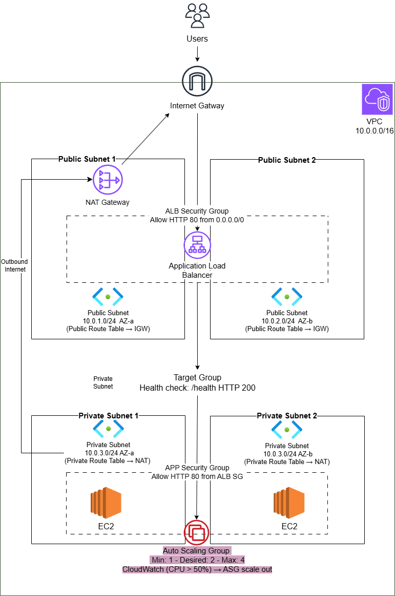
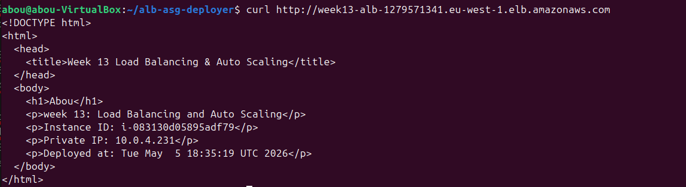
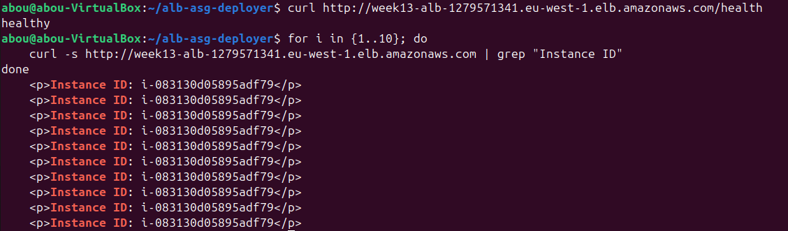
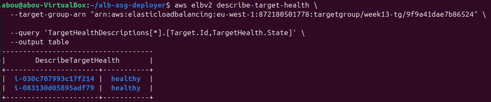

# ☁️ Week 13 — Load Balancing & Auto Scaling: `alb-asg-deployer`

> **Cloud Engineering Roadmap** · Week 13 of 24

A fully scripted AWS high-availability deployment that builds a production-ready **Application Load Balancer + Auto Scaling Group architecture** — multi-AZ public/private subnets, ALB with health checks, launch templates, dynamic scaling policies, and complete teardown — all via Bash and the AWS CLI, zero console clicking.

---

## 📋 Overview

In Week 12, I built the **network foundation** (VPC, subnets, NAT, bastion).
This week, I move up the stack and build **high availability and scalability**.

`alb-asg-deployer` automates a real production pattern:

* Load balancing traffic across multiple instances
* Automatically replacing unhealthy instances
* Scaling infrastructure based on demand
* Keeping everything private and secure behind an ALB

This is the same architecture used in real-world systems before adding databases or microservices.

---

## 🏗️ Architecture



```
                   Internet
                       ↓
               Application Load Balancer
                (Public Subnets - 2 AZs)
                       ↓
        ┌────────────────────────────────────┐
        │           Target Group             │
        │       (Health checks /health)      │
        └────────────────────────────────────┘
                       ↓
        ┌────────────────────────────────────┐
        │      Auto Scaling Group (ASG)      │
        │  EC2 Instances (Private Subnets)   │
        │     Nginx + /health endpoint       │
        └────────────────────────────────────┘
                       ↓
                 NAT Gateway (Public)
                       ↓
                Internet Gateway
```

---

## 🌐 Traffic Flow

* `User → ALB → Target Group → EC2 instances`
* ALB distributes traffic using **round-robin**
* Health checks ensure only healthy instances receive traffic
* Private instances use:

  * `NAT Gateway → Internet` for updates (outbound only)
* Auto Scaling:

  * Adds instances when CPU increases
  * Removes instances when load drops

---

## 📁 Project Structure

```
alb-asg-deployer/
├── deploy.sh                 # Full deployment (multi-phase, idempotent)
├── teardown.sh               # Safe cleanup (dependency-aware)
├── userdata_alb.sh           # EC2 boot script (Nginx + metadata page)
├── config.env                # Config variables (not committed)
├── .deploy_state             # Resource tracking (generated)
├── diagrams/
│   └── architecture.png
└── README.md
```

---

## ✨ Features

* ⚖️ **Application Load Balancer (ALB)** — distributes traffic across instances
* 🔁 **Auto Scaling Group (ASG)** — maintains desired capacity & replaces unhealthy instances
* 🧠 **Target Group Health Checks** — `/health` endpoint validation
* 📈 **Dynamic Scaling Policy** — CPU-based target tracking (50%)
* 🌍 **Multi-AZ High Availability** — subnets across 2 availability zones
* 🔒 **Private EC2 Instances** — no public IPs, secure by design
* 🌐 **NAT Gateway Integration** — outbound internet access only
* ⚙️ **Launch Template Automation** — consistent EC2 configuration
* 🔄 **Idempotent Deployment** — safe re-runs using `.deploy_state`
* 🧹 **Clean Teardown** — proper dependency order

---

## 🛠️ Skills Demonstrated

| Area                  | Details                                      |
| --------------------- | -------------------------------------------- |
| **Load Balancing**    | ALB setup, listeners, routing, health checks |
| **Auto Scaling**      | ASG lifecycle, desired/min/max capacity      |
| **High Availability** | Multi-AZ architecture design                 |
| **Target Groups**     | Health checks, deregistration delay          |
| **Launch Templates**  | EC2 configuration standardization            |
| **Cloud Monitoring**  | CPU-based scaling policies                   |
| **Networking**        | Public vs private traffic flow               |
| **Bash Scripting**    | Multi-phase idempotent deployments           |
| **AWS CLI**           | Full automation of ALB + ASG stack           |

---

## ⚙️ Technical Highlights

### 🔁 Idempotent Deployment (State-Based)

Each phase checks `.deploy_state` before executing:

```bash
if [ "${PART_C_DONE:-false}" = "true" ]; then
  echo "ALB already created"
else
  run_part_c
fi
```

---

### ❤️ Health Check Endpoint (Nginx)

The instances expose a `/health` endpoint used by the ALB:

```nginx
location /health {
    access_log off;
    return 200 "healthy\n";
}
```

---

### ⚖️ Target Group Configuration

```bash
aws elbv2 create-target-group \
  --health-check-path "/health" \
  --health-check-interval-seconds 30 \
  --healthy-threshold-count 2 \
  --unhealthy-threshold-count 3
```

Only healthy instances receive traffic.

---

### 📈 Auto Scaling Policy (Target Tracking)

```bash
aws autoscaling put-scaling-policy \
  --policy-type TargetTrackingScaling \
  --target-tracking-configuration '{
    "PredefinedMetricSpecification": {
      "PredefinedMetricType": "ASGAverageCPUUtilization"
    },
    "TargetValue": 50.0
  }'
```

* Keeps average CPU around **50%**
* Automatically scales out/in

---

### 🚀 Launch Template (User Data)

Instances are fully configured at boot:

* Install Nginx
* Fetch instance metadata (IMDSv2)
* Generate dynamic HTML page

```bash
INSTANCE_ID=$(curl -H "X-aws-ec2-metadata-token: $TOKEN" ...)
```

---

### 🔄 NAT Gateway Polling

```bash
while true; do
  STATE=$(aws ec2 describe-nat-gateways ...)
  [ "$STATE" = "available" ] && break
  sleep 10
done
```

---

### 🧹 Correct Teardown Order

```
ASG → Launch Template → ALB → Target Group
→ NAT Gateway → EIP → Security Groups
→ Route Tables → IGW → Subnets → VPC
```

---

## 🚀 Setup & Configuration

### Prerequisites

* AWS CLI configured
* Bash environment (Linux / WSL / macOS)
* IAM permissions for EC2, ELB, Auto Scaling

---

### 1. Clone repo

```bash
git clone https://github.com/<your-username>/alb-asg-deployer.git
cd alb-asg-deployer
```

---

### 2. Configure environment

```bash
cp config.env.example config.env
```

Example:

```bash
REGION="eu-west-1"

VPC_CIDR="10.0.0.0/16"

PUBLIC_SUBNET_1_CIDR="10.0.1.0/24"
PUBLIC_SUBNET_2_CIDR="10.0.2.0/24"

PRIVATE_SUBNET_1_CIDR="10.0.3.0/24"
PRIVATE_SUBNET_2_CIDR="10.0.4.0/24"

AZ_1="eu-west-1a"
AZ_2="eu-west-1b"

INSTANCE_TYPE="t3.micro"
AMI_ID="ami-xxxxxxxxxxxx"

KEY_NAME="week13-key"

ALB_SG_NAME="week13-alb-sg"
APP_SG_NAME="week13-app-sg"

ASG_NAME="week13-asg"
LT_NAME="week13-launch-template"
TG_NAME="week13-tg"
ALB_NAME="week13-alb"

PROJECT_TAG="cloudpath"
WEEK_TAG="13"
```

---

### 3. Run deployment

```bash
chmod +x deploy.sh teardown.sh
./deploy.sh
```

---

## ✅ Expected Output

```
✅ Infrastructure deployed!

🌐 ALB DNS:  week13-alb-xxx.eu-west-1.elb.amazonaws.com
🔗 URL:      http://week13-alb-xxx.eu-west-1.elb.amazonaws.com
⚡ Health:   http://week13-alb-xxx.eu-west-1.elb.amazonaws.com/health

⏳ Note: Instances are starting. Wait ~2 minutes before testing.
```

---

## 🧪 Testing

### 1. Test Load Balancer

```bash
curl http://<ALB_DNS>
```

Refresh multiple times → different instance IDs

Example terminal output:


Or verify with loop:

```bash
for i in {1..10}; do
    curl -s http://<ALB-DNS> | grep "Instance ID"
done
```
Example terminal output:


---

### 2. Test Health Check

```bash
curl http://<ALB_DNS>/health
```

Expected:

```
healthy
```
Example terminal output:


---

### 3. Test Auto Scaling

Generate CPU load:

```bash
yes > /dev/null &
```

Then:

```bash
aws autoscaling describe-auto-scaling-groups ...
```

→ New instances should launch

Stop load:

```bash
killall yes
```

→ Instances scale down

---

## 🧹 Teardown

```bash
./teardown.sh
```

> ⚠️ Always clean up — NAT Gateway costs money even when idle.

---

## 🔐 Security Notes

* EC2 instances are **private only**
* Only ALB is publicly accessible
* App SG allows:

  * HTTP from ALB SG
  * SSH from your IP (temporary for debugging)
* No credentials stored on instances
* `.deploy_state` and `config.env` are ignored in Git

---

## 📚 What I Learned

* How ALB distributes traffic across instances
* Difference between **Target Group vs Auto Scaling**
* Why health checks are critical (not just “instance running”)
* How ASG maintains desired capacity automatically
* Real behavior of scaling (delays, cooldowns, termination timing)
* Why private instances + ALB is the standard production model
* How to design **highly available systems across AZs**
* Building fully idempotent infrastructure scripts

---

## 🔗 Next Step

Week 14+ → Databases on AWS.

---

*Part of the Cloud Engineering Roadmap — from Linux to production-grade AWS systems.*

