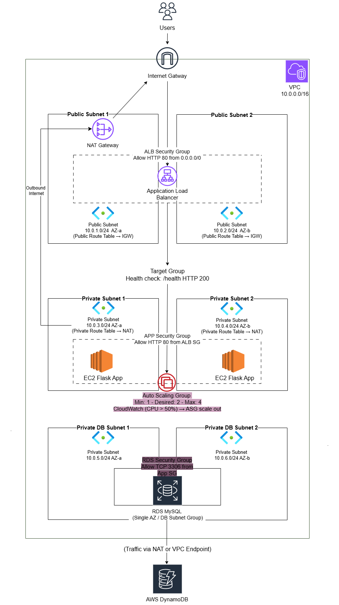
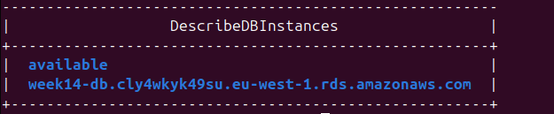
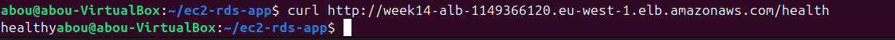
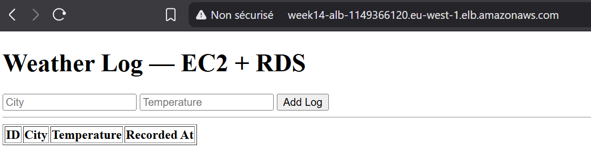
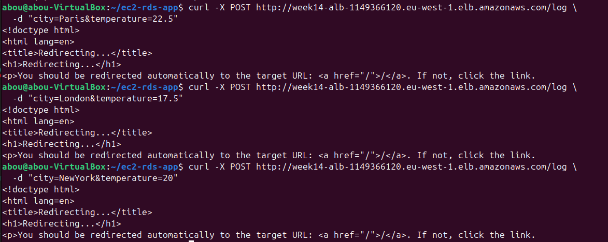
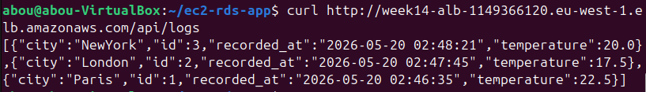
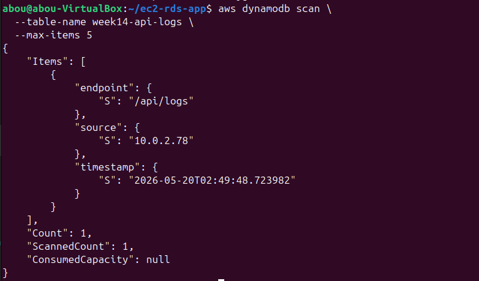
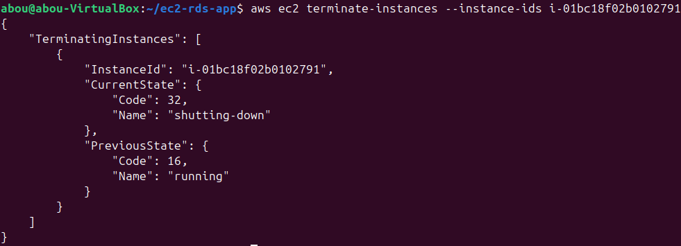
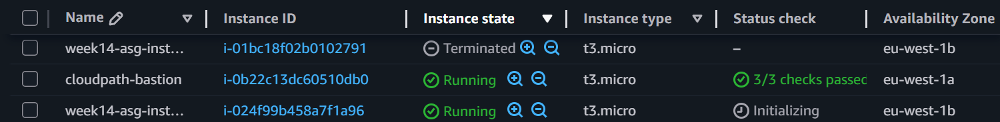
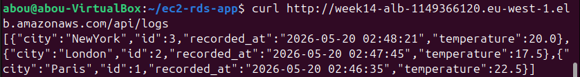

# ☁️ Week 14 — RDS & Full-Stack AWS Application: `ec2-rds-app`

> **Cloud Engineering Roadmap** · Week 14 of 24

A fully scripted AWS three-tier application that deploys a production-style architecture using **Application Load Balancer, Auto Scaling Group, EC2, RDS MySQL, S3, and DynamoDB** — all automated with Bash and the AWS CLI.

---

## 📋 Overview

Week 14 takes the infrastructure from Week 13 and adds the most critical missing component in real applications:

> **A persistent database layer.**

This project, `ec2-rds-app`, deploys a complete cloud application stack:

* Application Load Balancer (ALB)
* Auto Scaling Group (ASG)
* Private EC2 instances running a Flask application
* Amazon RDS MySQL database
* Amazon S3 for application artifact storage
* Amazon DynamoDB for API request logging
* Bastion host for secure SSH access
* Fully automated deployment and teardown

The result is a real-world architecture where compute is ephemeral, but data persists.

---

## 🏗️ Architecture



```text
                           Internet
                               │
                               ▼
                    Application Load Balancer
                         (Public Subnets)
                               │
                               ▼
                    Auto Scaling Group (EC2)
                     Flask App in Private Subnets
                               │
                 ┌─────────────┴─────────────┐
                 ▼                           ▼
          Amazon RDS MySQL            Amazon DynamoDB
        weather_log table            API access logs
                 ▲
                 │
                 ▼
               Amazon S3
      (application code + migrations)

                               ▲
                               │
                         Bastion Host
                         (Public Subnet)
```

---

## 🌐 Traffic Flow

### Web Requests

1. User accesses the ALB DNS name.
2. ALB forwards the request to a healthy EC2 instance.
3. The Flask application processes the request.
4. Flask reads or writes data in RDS.
5. The `/api/logs` endpoint also records the request to DynamoDB.
6. The response is returned to the user.

### Instance Boot Process

1. ASG launches a new EC2 instance.
2. User Data installs system packages and Python dependencies.
3. EC2 IAM role downloads application files from S3.
4. SQL migration initializes the MySQL schema if needed.
5. `systemd` starts the Flask application.
6. ALB health checks `/health`.
7. Once healthy, the instance begins serving traffic.

---

## 📁 Project Structure

```text
ec2-rds-app/
├── deploy.sh                 # Full deployment automation
├── teardown.sh               # Dependency-aware cleanup
├── userdata.sh               # EC2 bootstrap script
├── config.env                # Configuration variables (not committed)
├── .deploy_state             # Resource state tracking (generated)
│
├── app/
│   ├── app.py                # Flask application
│   ├── requirements.txt      # Python dependencies
│   └── templates/
│       └── index.html        # HTML dashboard
│
├── migrations/
│   └── init.sql              # Database schema
│
├── diagrams/
│   └── architecture.png
│
├── output_screenshots/
│
└── README.md
```

---

## ✨ Features

* 🌐 **Application Load Balancer** for traffic distribution
* 🔁 **Auto Scaling Group** for high availability and scaling
* 🐍 **Flask Web Application** running on private EC2 instances
* 🗄️ **Amazon RDS MySQL** for persistent relational storage
* 📦 **Amazon S3** for application artifact storage
* 📊 **Amazon DynamoDB** for API access logging
* 🔐 **IAM Role + Instance Profile** for secure AWS access
* 🛡️ **Security Group Chaining** between ALB, EC2, and RDS
* ❤️ **Health Checks** using `/health`
* 🔄 **Idempotent Deployment** using `.deploy_state`
* 🧹 **Safe Teardown** with dependency-aware deletion

---

## 🛠️ Skills Demonstrated

| Area                 | Details                                   |
| -------------------- | ----------------------------------------- |
| Relational Databases | MySQL on Amazon RDS                       |
| Web Development      | Flask routes, templates, forms, JSON APIs |
| NoSQL                | DynamoDB integration                      |
| Object Storage       | S3 artifact hosting                       |
| IAM                  | Roles, policies, instance profiles        |
| Load Balancing       | ALB + Target Groups                       |
| Auto Scaling         | CPU target tracking                       |
| Networking           | Multi-AZ public/private design            |
| Linux Automation     | User Data + systemd                       |
| Bash Scripting       | Full infrastructure automation            |

---

## ⚙️ Technical Highlights

### 🗄️ RDS Schema Initialization

```sql
CREATE DATABASE IF NOT EXISTS myapp;
USE myapp;

CREATE TABLE IF NOT EXISTS weather_log (
    id INT AUTO_INCREMENT PRIMARY KEY,
    city VARCHAR(100),
    temperature FLOAT,
    recorded_at TIMESTAMP DEFAULT CURRENT_TIMESTAMP
);
```

---

### 🐍 Flask Application Routes

| Route       | Method | Purpose                                            |
| ----------- | ------ | -------------------------------------------------- |
| `/`         | GET    | Render HTML dashboard with weather logs            |
| `/health`   | GET    | Return `healthy` for ALB health checks             |
| `/log`      | POST   | Insert a new weather record                        |
| `/api/logs` | GET    | Return logs as JSON and record request in DynamoDB |

---

### ❤️ Health Check Endpoint

```python
@app.route("/health")
def health():
    return "healthy", 200
```

---

### 📊 DynamoDB API Logging

```python
log_table.put_item(Item={
    "endpoint": "/api/logs",
    "timestamp": datetime.utcnow().isoformat(),
    "source": request.remote_addr
})
```

---

### 📦 S3 Artifact Download

```bash
aws s3 cp s3://$BUCKET_NAME/app/ /app/ --recursive
aws s3 cp s3://$BUCKET_NAME/migrations/ /migrations/ --recursive
```

---

### 🔐 IAM Permissions

The EC2 IAM role includes:

* `AmazonS3ReadOnlyAccess`
* Custom DynamoDB permissions:

  * `dynamodb:PutItem`
  * `dynamodb:GetItem`
  * `dynamodb:Query`
  * `dynamodb:Scan`

---

### 📈 Auto Scaling Policy

```bash
aws autoscaling put-scaling-policy \
  --auto-scaling-group-name "$ASG_NAME" \
  --policy-name "cpu-target-50" \
  --policy-type TargetTrackingScaling \
  --target-tracking-configuration '{
    "PredefinedMetricSpecification": {
      "PredefinedMetricType": "ASGAverageCPUUtilization"
    },
    "TargetValue": 50.0
  }'
```

---

### 🧹 Teardown Order

```text
ASG
→ Launch Template
→ ALB Listener
→ ALB
→ Target Group
→ RDS
→ DB Subnet Group
→ DynamoDB Table
→ NAT Gateway
→ Elastic IP
→ Security Groups
→ Route Tables
→ Internet Gateway
→ Subnets
→ VPC
```

---

## 🚀 Setup & Configuration

### Prerequisites

* AWS CLI configured
* Bash environment (Linux / WSL / macOS)
* IAM permissions for EC2, RDS, ELB, ASG, S3, and DynamoDB

---

### 1. Clone Repository

```bash
git clone https://github.com/<your-username>/ec2-rds-app.git
cd ec2-rds-app
```

---

### 2. Configure Environment

```bash
cp config.env.example config.env
```

Example configuration:

```bash
REGION="eu-west-1"

PROJECT_TAG="cloudpath"
WEEK_TAG="14"

AMI_ID="ami-xxxxxxxxxxxxx"
INSTANCE_TYPE="t3.micro"
KEY_NAME="week14-key"

VPC_CIDR="10.0.0.0/16"

PUBLIC_SUBNET_1_CIDR="10.0.1.0/24"
PUBLIC_SUBNET_2_CIDR="10.0.2.0/24"

PRIVATE_SUBNET_1_CIDR="10.0.3.0/24"
PRIVATE_SUBNET_2_CIDR="10.0.4.0/24"

AZ_1="eu-west-1a"
AZ_2="eu-west-1b"

ALB_NAME="week14-alb"
TG_NAME="week14-tg"
ASG_NAME="week14-asg"
LT_NAME="week14-launch-template"

DB_INSTANCE_ID="week14-db"
DB_NAME="myapp"
DB_USER="admin"
DB_PASSWORD="your-secure-password"

BUCKET_NAME="week14-app-bucket"
DYNAMODB_TABLE_NAME="week14-api-logs"

IAM_ROLE_NAME="week14-ec2-role"
IAM_INSTANCE_PROFILE_NAME="week14-ec2-profile"
```

---

### 3. Deploy Infrastructure

```bash
chmod +x deploy.sh teardown.sh
./deploy.sh
```

---

## ✅ Expected Output

```text
✅ Infrastructure deployed successfully!

🌐 ALB DNS:
http://week14-alb-xxxxxxxx.eu-west-1.elb.amazonaws.com

🗄️ RDS Endpoint:
week14-db.xxxxx.eu-west-1.rds.amazonaws.com

📊 DynamoDB Table:
week14-api-logs

📦 S3 Bucket:
week14-app-bucket
```

---

## 🧪 Verification

### 1. Verify RDS

```bash
aws rds describe-db-instances \
  --db-instance-identifier week14-db \
  --query 'DBInstances[0].[DBInstanceStatus,Endpoint.Address]' \
  --output table
```

Example terminal output:


---

### 2. Verify Health Check

```bash
curl http://<ALB_DNS>/health
```

Expected:

```text
healthy
```

Example terminal output:


---

### 3. Open the Web Dashboard

Navigate to:

```text
http://<ALB_DNS>/
```

The page displays:

* A form to submit a city and temperature
* A table of all weather records stored in MySQL

Example web output:


---

### 4. Insert Data via API

```bash
curl -X POST http://<ALB_DNS>/log \
  -d "city=Paris&temperature=22.5"
```

Example terminal output:


---

### 5. Retrieve Data as JSON

```bash
curl http://<ALB_DNS>/api/logs
```

Example terminal output:


---

### 6. Verify DynamoDB Logging

```bash
aws dynamodb scan \
  --table-name week14-api-logs \
  --max-items 5
```

Example terminal output:


---

### 7. Verify Persistence Across Instance Replacement

Terminate one application instance:

```bash
aws ec2 terminate-instances --instance-ids <instance-id>
```

Example terminal output:


Example AWS consol output:


Wait for ASG to launch a replacement, then run:

```bash
curl http://<ALB_DNS>/api/logs
```

Example terminal output:


The same data remains available because the source of truth is RDS, not EC2.

---

## 🧠 Application Workflow Explained

### `/` Route

* Queries `weather_log` from MySQL.
* Renders `templates/index.html`.
* Displays a web form and table.

### `/log` Route

* Accepts POST form data.
* Inserts a row into MySQL.
* Redirects back to `/`.

### `/api/logs` Route

* Writes a request log to DynamoDB.
* Queries MySQL.
* Returns a JSON array.

### `/health` Route

* Returns a simple `healthy` response.
* Used exclusively by the ALB health check.

---

## 🔐 Security Design

### Security Group Chain

```text
Internet
→ ALB Security Group
→ App Security Group
→ RDS Security Group
```

### Access Rules

* ALB: HTTP (80) from the internet
* App EC2: HTTP only from ALB Security Group
* RDS: MySQL (3306) only from App Security Group
* Bastion: SSH only from your public IP

---

## 📚 What I Learned

* Difference between compute and persistent storage
* Why RDS is the source of truth
* How Flask interacts with relational databases
* How DynamoDB complements RDS
* How S3 distributes application artifacts
* IAM roles for secure AWS access without credentials
* Debugging User Data and `systemd`
* Designing resilient cloud-native applications

---

## 🧹 Teardown

```bash
./teardown.sh
```

> ⚠️ Always clean up resources — RDS and NAT Gateway continue incurring costs.

---

## 🔗 Next Step

Week 15 → Infrastructure as Code with Terraform.

---

*Part of the Cloud Engineering Roadmap — building production-grade AWS systems from scratch.*
